# Clash in Autodl

## 下载项目

下载项目

```bash
git clone https://github.com/qqqqqhsdhs/Clash-in-Autodl.git
```

进入到项目目录，编辑`.env`文件，修改变量`CLASH_URL`的值。

```bash
cd Clash-in-Autodl
mv conf/template_raw.yaml conf/template.yaml
cp .env.example .env
vim .env
```


CLASH_URL填写订阅地址，CLASH_SECRET可自行填写（例如“123456”）。填写后按“:wq”退出。

<br>

## 启动程序

直接运行脚本文件`start.sh`

- 进入项目目录

```bash
cd clash-for-AutoDL
```

安装lsof

```bash
apt-get update
apt-get install lsof
```


- 运行启动脚本

```bash
source ./start.sh
```

在“是否要在 .bashrc 中自动添加 proxy_on 命令？(y/n): ”后填y。

- 检查服务端口

```bash
lsof -i -P -n | grep LISTEN | grep -E ':6006|:789[0-9]'
```

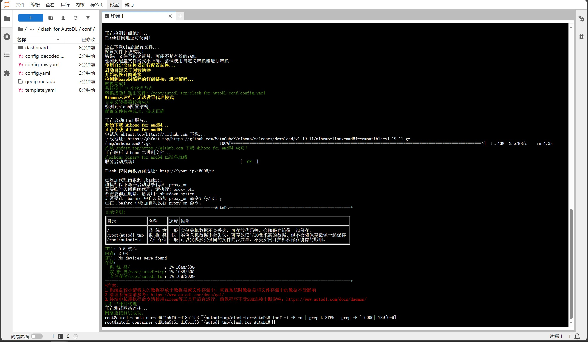

这时发现并没有端口出现。

<br>

## 修改配置文件

- 打开Windows中配置文件

打开电脑中Clash for Windows，点击Profiles。在自己的订阅右键并点击Edit。

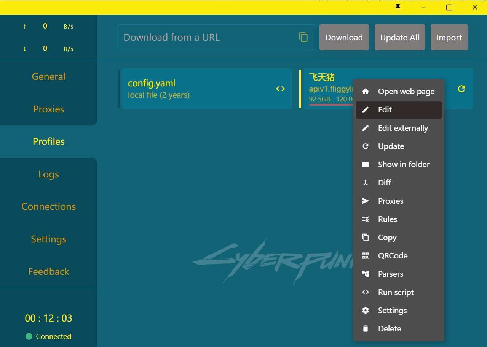

- 复制

选中proxies，proxy-groups，rules并复制到Autodl的clash-for-AutoDL/conf/config.yaml中。

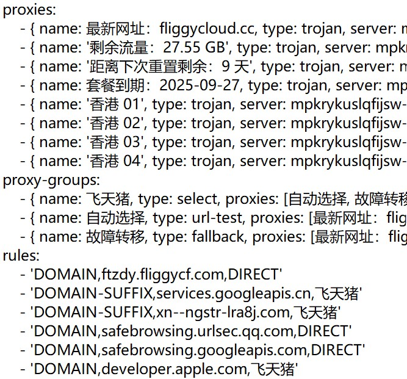

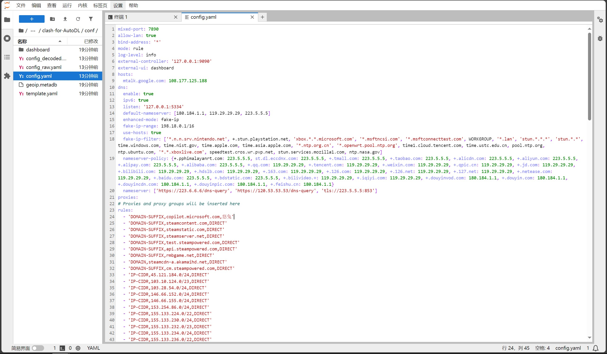

从21行“proxies:”开始覆盖。

- 修改

在config.yaml第一行添加：

```bash
port: 7890 # HTTP代理端口
socks-port: 7892 # SOCKS5代理端口
```

注释：

```bash
# mixed-port: 7890
```

修改：

```bash
external-controller: '127.0.0.1:9090' -> external-controller: '127.0.0.1:6006'
```

将config.yaml的内容复制到template.yaml，使其一致。

- 重启

```bash
source ./restart.sh
```

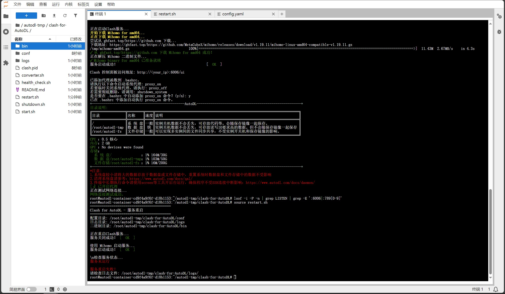

显示重启失败为正常情况。

命令行输入：

```bash
export http_proxy=http://127.0.0.1:7890
export https_proxy=http://127.0.0.1:7890
```

- 验证

```bash
source ./health_check.sh
```

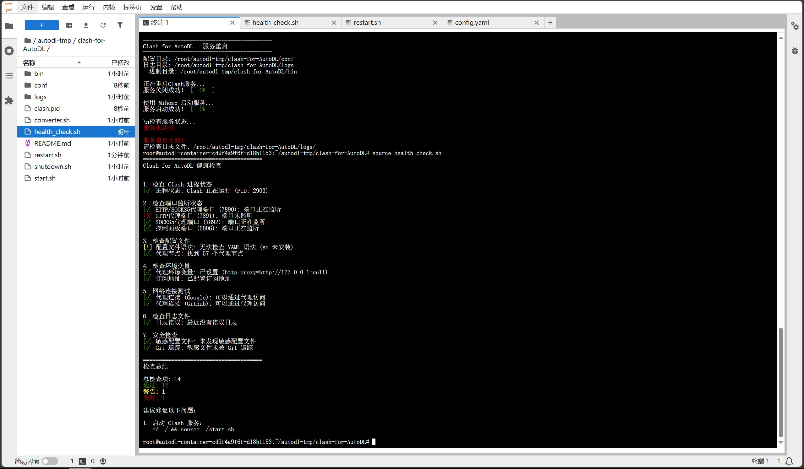

验证是否能进入谷歌

```bash
curl google.com
```

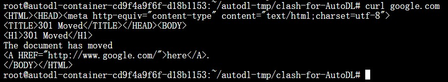

此时已经成功配置。

## 更换节点

- 方法一 （本人暂时连接失败）


根据 https://www.autodl.com/docs/ssh_proxy/ 下载图形化工具。


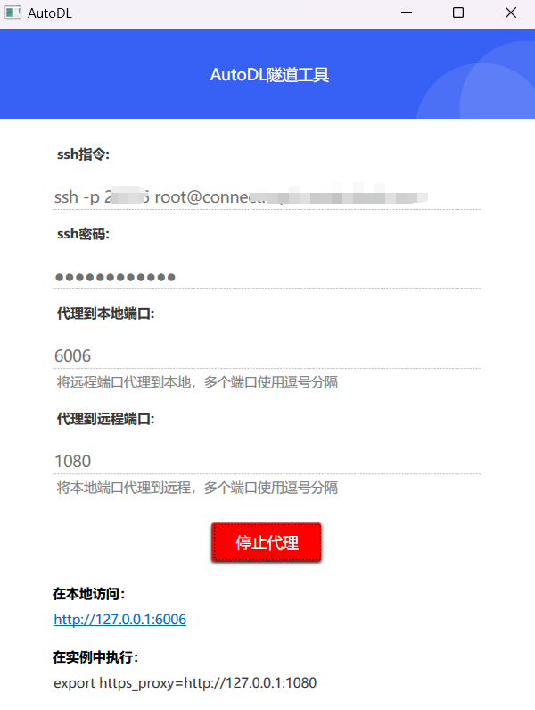

后进入Dashboard。

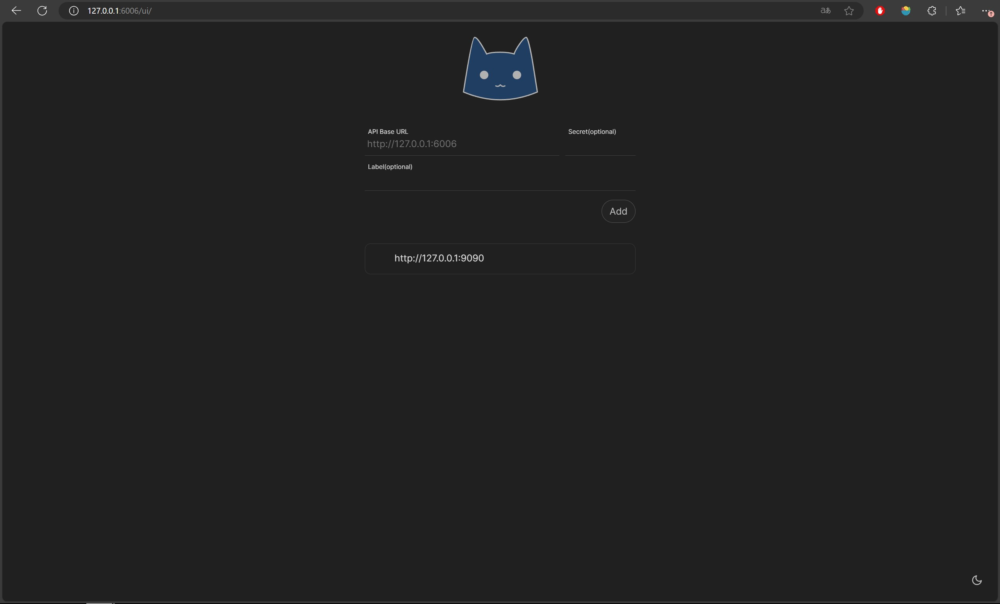

这里我填的是.env文件中的链接和密码，一直显示失败。。下面展示另一种

- 方法二

在config.yaml的proxy-groups中将希望使用的节点排在列表第一个。

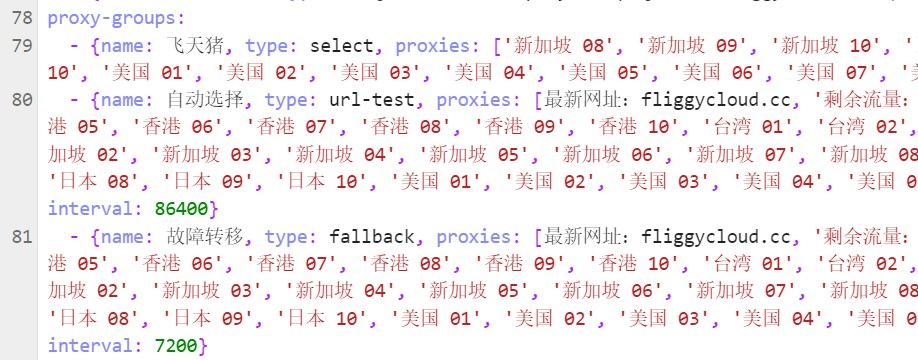

这里使用“新加坡 08”节点。

重启

```bash
source ./restart.sh
```

检查clash-for-AutoDL/logs/mihomo.log

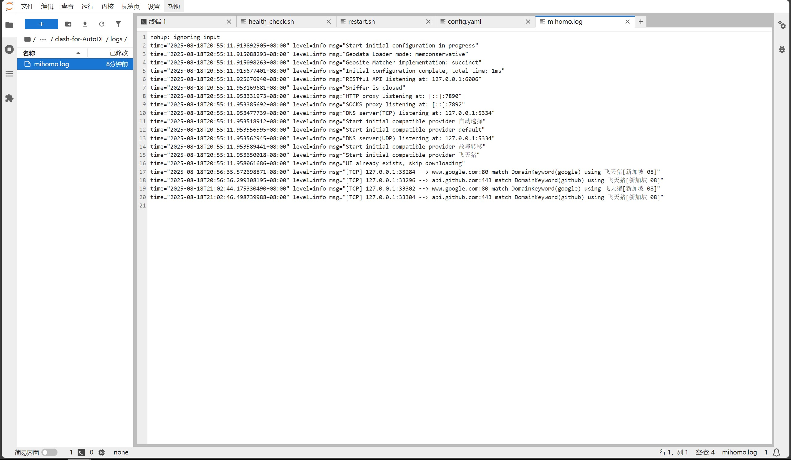

日志中显示希望更换的节点即成功。

